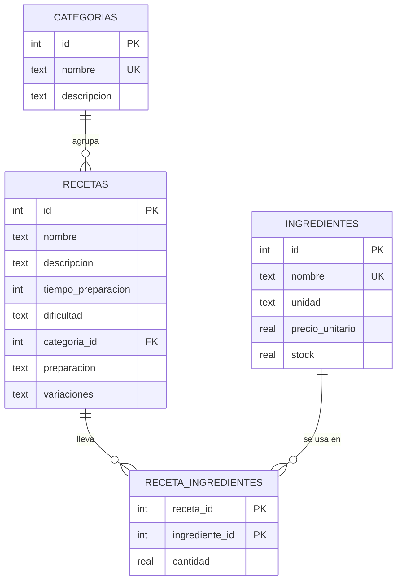

# 🍳 Chef Master Pro

Sistema de gestión gastronómica del **Instituto ORT Cuisine**: administra recetas, ingredientes y categorías, calcula el costo de cada plato y analiza los datos con Pandas.

**▶️ App en vivo: [chef-master-pro.streamlit.app](https://chef-master-pro.streamlit.app/)**

Trabajo integrador de **Desarrollo de Aplicaciones — 5° año, ORT**.

---

## Qué hace

**Recetas.** ABM completo con filtros por categoría, tiempo máximo y dificultad. Cada receta muestra sus ingredientes con cantidades, el costo estimado de cada uno y el total del plato, los pasos de preparación numerados y variantes alternativas del plato (versión vegetariana, al horno, sin alcohol, etc.).

**Ingredientes.** Inventario con precio por unidad y stock. Se puede buscar por nombre y filtrar por disponibilidad. Cada ingrediente calcula su costo para una cantidad dada.

**Categorías.** ABM de las categorías de cocina, mostrando qué recetas tiene asignadas cada una.

**Estadísticas.** Lee la base con Pandas y calcula medidas de tendencia central sobre el tiempo de preparación, con un párrafo de interpretación generado a partir de los datos reales. Desde acá también se importa el dataset del CSV.

La base arranca con **20 recetas, 45 ingredientes y 5 categorías** ya cargados.

## Stack

| | |
|---|---|
| Lenguaje | Python 3.10+ |
| Interfaz | Streamlit |
| Base de datos | SQLite (`sqlite3`, sin ORM) |
| Análisis | Pandas |
| Tests | pytest |

## Cómo ejecutarlo

```bash
pip install -r requirements.txt
```

```bash
streamlit run app.py
```

La base de datos (`chef_master.db`) se crea sola la primera vez, con las tablas, los datos de ejemplo y el dataset del CSV ya importado. No hace falta ningún paso previo.

Para borrar todo y empezar de cero, alcanza con eliminar `chef_master.db` y volver a levantar la app.

## Estructura

```
├── app.py               Interfaz Streamlit: navegación, formularios y vistas
├── models.py            Clases del dominio: Categoria, Ingrediente, Receta
├── database.py          Esquema, migraciones, datos de ejemplo y CRUD
├── importar_datos.py    Importación del dataset CSV con Pandas
├── tests_models.py      Tests unitarios de la lógica del dominio
├── datos/
│   └── recetas.csv      Dataset de 15 recetas
├── requirements.txt
└── .streamlit/
    └── config.toml      Tema visual
```

La aplicación está separada en capas: `models.py` no sabe nada de SQLite ni de Streamlit, `database.py` no sabe nada de la interfaz, y `app.py` solo orquesta. Por eso la lógica del dominio se puede testear sin levantar el servidor.

## Modelo de datos



`receta_ingredientes` resuelve la relación muchos a muchos entre recetas e ingredientes, guardando además la cantidad que lleva cada una. Borrar una receta arrastra sus ingredientes asociados (`ON DELETE CASCADE`); borrar una categoría deja las recetas sin categoría en vez de eliminarlas (`ON DELETE SET NULL`).

Los campos `preparacion` y `variaciones` guardan un elemento por renglón. `Receta.pasos()` y `Receta.variantes()` los convierten en listas, ignorando renglones vacíos y espacios sobrantes.

### Migraciones

`CREATE TABLE IF NOT EXISTS` no modifica tablas que ya existen, así que una base creada con una versión anterior del esquema se quedaría sin las columnas nuevas. `init_db()` compara contra `PRAGMA table_info` y agrega con `ALTER TABLE` las que falten, sin perder datos.

## El dataset

`datos/recetas.csv` tiene 15 recetas con columnas que corresponden a los atributos de la entidad `recetas`. Como cada receta tiene varios pasos, ingredientes y variaciones, esas listas van en una sola celda separadas por `|`, para que el archivo mantenga una fila por receta y siga siendo legible en Excel:

| Columna | Ejemplo |
|---|---|
| `nombre` | `Ñoquis de Papa` |
| `tiempo_preparacion` | `60` |
| `dificultad` | `Media` |
| `categoria` | `Pasta` |
| `preparacion` | `Hervir las papas...\|Pisarlas en caliente...` |
| `ingredientes` | `Papa:800\|Harina:250\|Huevo:1` |
| `variaciones` | `Versión a la romana: ...\|Versión rellena: ...` |

`importar_datos.py` lo lee con `pandas.read_csv()`, recorre el DataFrame y da de alta cada fila con `database.crear_receta()` — la misma función que usa el formulario de la app. Resuelve los nombres de categorías e ingredientes contra la base, y avisa por consola si alguno no existe en lugar de descartarlo en silencio. Correrlo dos veces no duplica nada: las recetas ya cargadas se omiten.

Se puede ejecutar desde la app (**Estadísticas → Importar Dataset**) o por consola:

```bash
python importar_datos.py
```

## Análisis de datos

La sección **Estadísticas** lee las recetas directamente de la base con `pandas.read_sql_query()` y calcula sobre el tiempo de preparación:

| Medida | Valor con el dataset incluido |
|---|---|
| Media | 47,75 min |
| Mediana | 45 min |
| Moda | 45 min (aparece 4 veces sobre 20) |

Debajo se muestra un párrafo interpretando qué significan esos números. No es un texto fijo: se arma comparando la media con la mediana para detectar si la distribución está corrida, y midiendo cuántas veces se repite la moda para decidir si es representativa o si los valores están repartidos. Si se cargan o borran recetas, el análisis se actualiza solo.

En este dataset la media es más alta que la mediana porque unas pocas recetas muy largas (el Tiramisú de 2 horas, los Ravioles de 1h 30) empujan el promedio hacia arriba, mientras que la mitad del recetario se prepara en 45 minutos o menos.

## Tests

```bash
python -m pytest tests_models.py -v
```

31 tests sobre la lógica del dominio: el cálculo de costos, la disponibilidad de stock, la clasificación de recetas por complejidad, el formateo de tiempos y el parseo de pasos y variaciones.

> El archivo se llama `tests_models.py`, que no coincide con el patrón `test_*.py` que busca pytest por defecto, así que hay que nombrarlo explícitamente como en el comando de arriba.

## Deploy

Publicado en **Streamlit Community Cloud**, conectado a la rama `main` de este repositorio.

La base de datos vive en el disco del contenedor y no está versionada, así que si la plataforma reinicia la aplicación se regenera desde el seed y el CSV, volviendo a las 20 recetas iniciales. Los cambios que se carguen desde la app publicada no son permanentes.

## Autores

<!-- Completar con los nombres del grupo -->

Instituto ORT Argentina — 5° año, Desarrollo de Aplicaciones.
